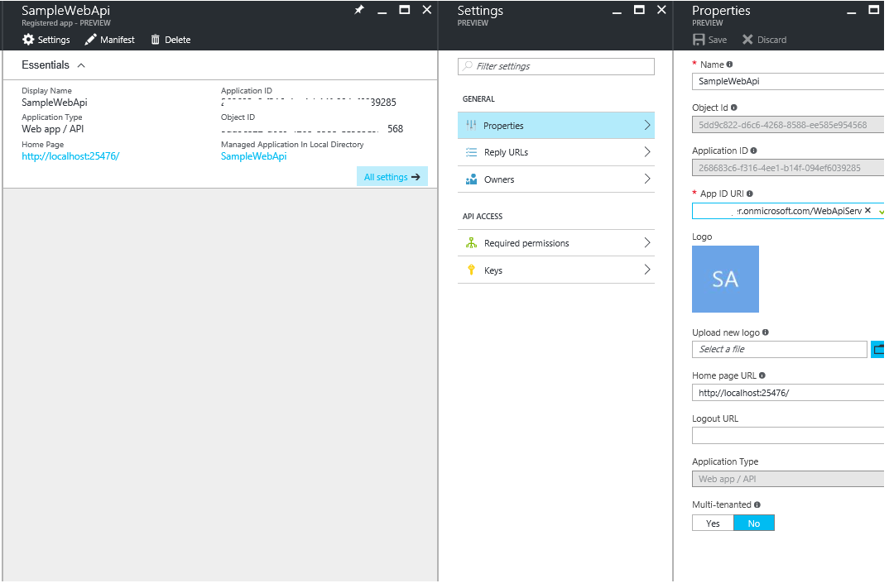

# ng2AzureAD
   This Project uses Angular 2 Js Client and 
   .Net Web API Server Authenticated with Azure AD

# Prerequisities

 - Visual Studio 2015
 - An Azure subscription(free is fine)
 - Create Azure AD from your azure subscriptions. 
 - Node Js installed
 - ng-cli installed in your system globally.
 
 

# Step 1: Clone or download this repository

From your Visual studio or command line: git clone https://github.com/karthikeyanVK/ng2AzureAD.git

# Step 2: Setup Web API Application in Azure AD

1.  Sign in to the [Azure portal](https://portal.azure.com).
2.  On the top bar, click on your account and under the **Directory** list, choose the Active Directory tenant where you wish to register your application.
  
3.  Click on **More Services** in the left hand nav, and choose **Azure Active Directory**.
4.  Click on **App registrations** and choose **Add**.
  
5.  Name the application, eg:. 'SampleWebAPI' and select 
  'Web Application and/or Web API' as the Application Type. For the sign-on URL, 
  as `https://localhost:25476`.

6.  Click on **Create** to create the application.
7.  Navigate to the SampleWebAPI and then change  APP ID URI, enter https://<your_tenant_name>/TodoListService,
     replacing **<your_tenant_name>** with the name of your Azure AD tenant. We will use https://contoso.onmicrosoft.com/TodoListService
        
8.   Save the Changes

# Step 3: Setup Angular 2 Application in Azure AD

1. Click on **App registrations** and choose **Add**.
  
2.  Enter a name for the application, eg:. 'AngularWebAPP' and select 
  'Web Application and/or Web API' as the Application Type. For the sign-on URL, 
  enter the base URL for the sample, which is by default `https://localhost:4200`.

3.  Click on **Create** to create the application.
4.   Save the Changes
5.   While still in the Azure portal, choose your application, click on **Settings** and choose **Properties**.
6.   Find the Application ID value and copy it to the clipboard.
7.   Configure Permissions for your application - in the Settings menu, choose the 'Required permissions' section, click on **Add**, then **Select an API**, and type "SampleWebAPI" in the text box. Then, click on  **Select Permissions** and select 'Access SampleWebAPI'
8.   Grant permissions across your tenant for your application. Go to Settings -> Properties -> Required Permissions, and click on the **Grant Permissions** button in the top bar. Click **Yes** to confirm.
    
 
  **IF GRANT PERMISSION NOT WORKING IN NEW PORTAL**
 
 Searching and selecting the other application in new portal (eg:-SampleWebAPI)is fuzzy and slow, Alternatively you can use old portal to give permission find the application in the directory -> Click on Add Application -> Search and then add delegated permissions as below.

 ## Step 5:  Enable the OAuth2 implicit grant for Angular APP application

 1.  While still in the Azure portal, In your application page, click on **Manifest** to open the inline manifest editor. 
 2.  Change `oauth2AllowImplicitFlow` property to `true` as below, by default it will be false.
  
 3. Save the changes

## Step 6: Configure Web.Config of Web API Application

1. Open the `ng2-ADWebAPI` application in Visual Studio 2015
2. Rename the `Web.template.config` as `Web.config`
3. Change the app key of `Tenant` with AAD Tenant name in our case `contoso.onmicrosoft.com`
4. Change the app key of `Audience` with Tenant name in our case 'https://contoso.onmicrosoft.com/TodoListService'

## Step 7: Configure Angular 2 APP

1. Navigate to `ng2-ADAuth` application in command prompt or git bash and run `npm install`
2. npm install will install the angular based ad js library known as ng2-adal and angular2-adal
3. Rename  `ng2-ADAuth/src/app/common/authentication/auth-config.service.ts.template` to `ng2-ADAuth/src/app/common/authentication/auth-config.service.ts`
4. Make sure you add endpoints, tenant, clientId as example provided in `auth-config.service.ts` 

### Step 8: Publish the AngularWebAPP to Azure Web Sites

1. Switch to Visual Studio and go to the AngularWebAPP project.  Right click on the project in the Solution Explorer and select Publish.  Click Import, and import the AngularWebAPP publish profile you downloaded.
6. On the Connection tab, update the Destination URL to https**(only https is supported for external url's)** , for example https://AngularWebAPP-contoso.azurewebsites.net.  Click Next.
7. On the Settings tab, make sure Enable Organizational Authentication is NOT selected.  Click Publish.
8. Visual Studio will publish the project and automatically open a browser to the URL of the project.  If you see the default web page of the project, the publication was successful.

### Step 9: Update the To Do SPA Configuration in the Directory Tenant

1. Sign in to the [Azure portal](https://portal.azure.com).
2. On the top bar, click on your account and under the **Directory** list, choose your Active Directory tenant.
2. Click on **More Services** in the left hand nav, and choose **Azure Active Directory**.
3. Click on **App registrations** and select the To Do SPA application.
4. Go to **Settings** --> **Properties**, and update the Sign-On URL to the address of your SPA, for example https://TodoListService-contoso.azurewebsites.net.
5. Go to **Settings** --> **Reply URLs** and update the Reply URL field to the address of your SPA, for example https://TodoListService-contoso.azurewebsites.net.

## About the Code

1. When accessing web API Use the AuthHttpModule instead of angular http module, which will take care of adding the bearer token into the request that goes from the web application( refer`ng2-ADAuth/src/app/home/home.component.ts
`)
2. `authenticatorGuard.guard` is used for validating the AD routing in angular.
3. Import `import { AdalService } from "ng2-adal/services/adal.service";`, `import { AuthConfigService } from './common/authentication/auth-config.service'`,`import { AuthenticatorGuard } from './common/authentication/authenticatorGuard.guard';` into `app.module.ts`
4. We use `ng2-Adal` for the AD connectity functionality in angular app.
5. Install below nugget packages to Web API Project
`            PM> Install-Package Microsoft.Owin.Security.ActiveDirectory`
`             PM> Install-Package Microsoft.Owin.Host.SystemWeb`
6. Add Owin Startup Class as below to App_Start as in ` ng2AzureAD/ng2-ADWebAPI/ng2-ADWebAPI/App_Start/Startup.cs
`
7. Add [Authorize] attribute to ValuesController on class level.
8. Enable Cors `config.EnableCors(cors)` as in ` ng2AzureAD/ng2-ADWebAPI/ng2-ADWebAPI/App_Start/WebApiConfig.cs
` 
 

